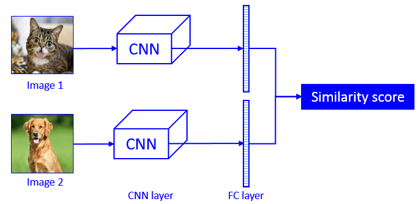
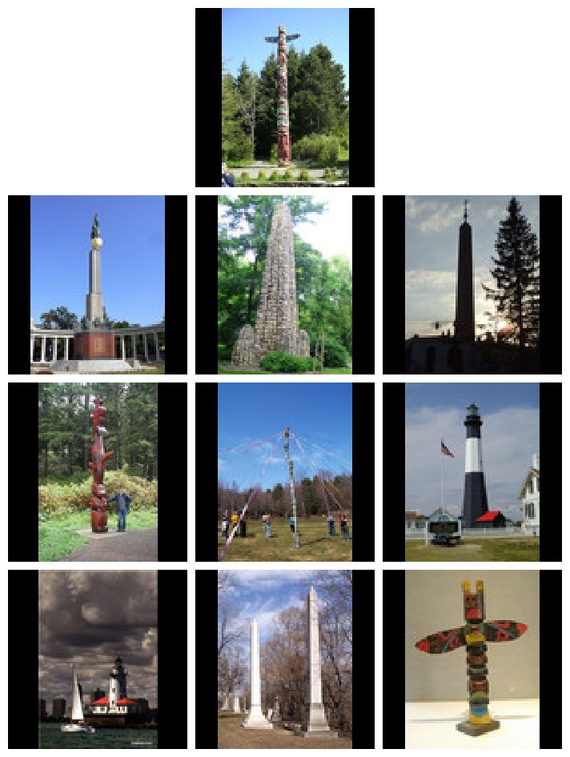
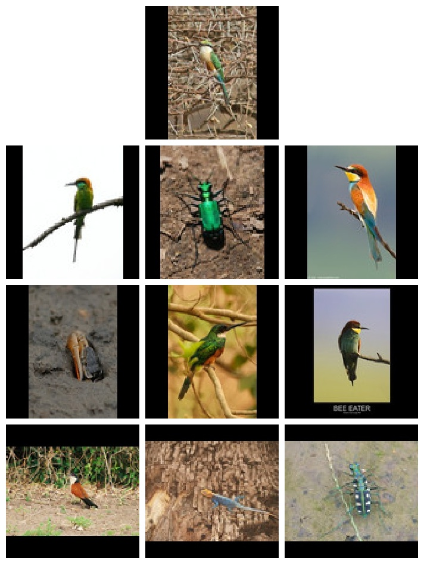
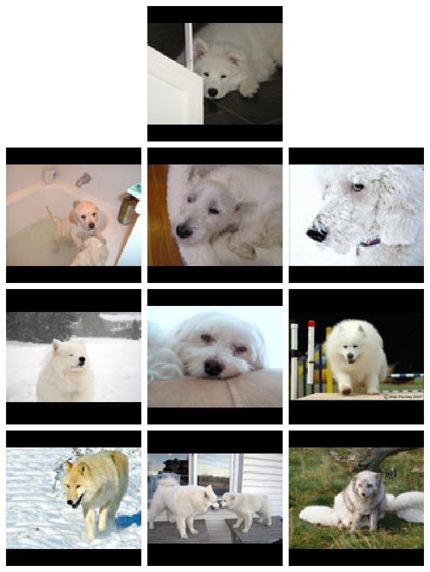
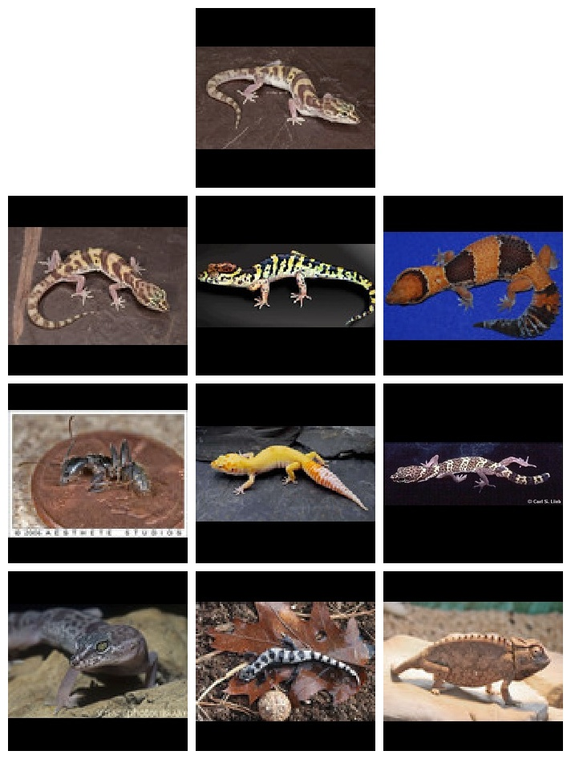
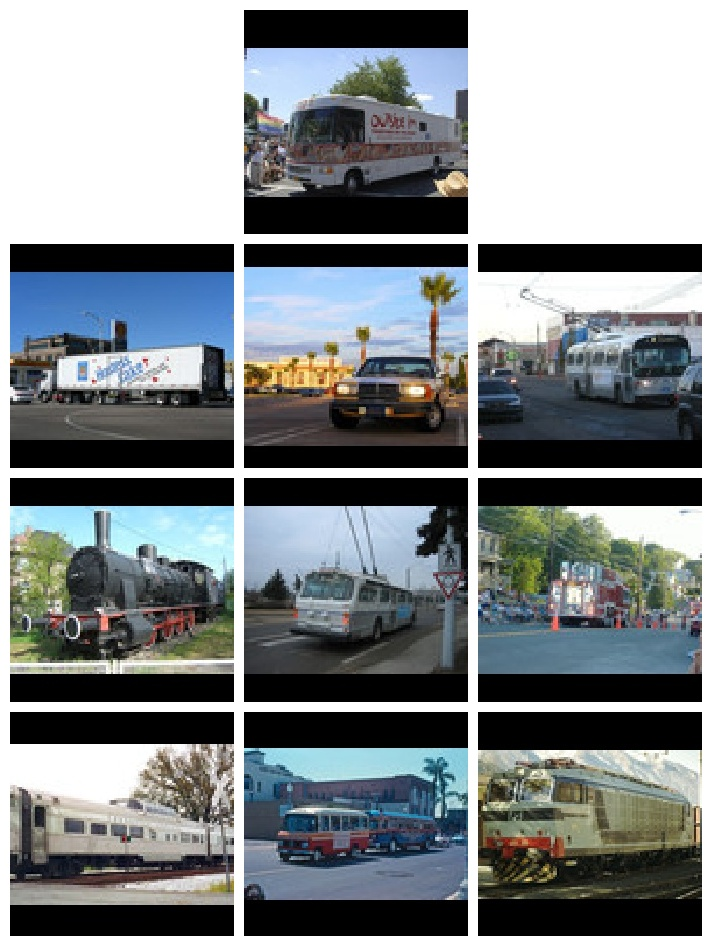
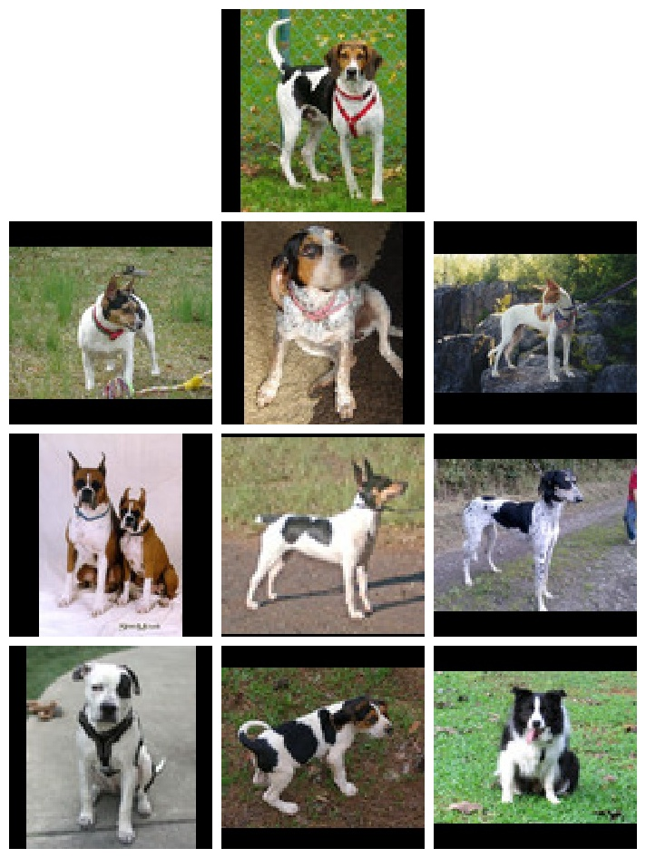

# Reverse_Image_Search
Reverse Image Search project on a subset of the Image-Net dataset using pre-trained model weights. For any querry image, finds the 9 most similar images in the dataset.

  
## Algorithm for reverse search:
0) Get vectors for all images in the dataset and store them as .pickle files (Done once, after this, the vector files are read directly)
1) For any query image, find the vector features by running the model.
2) Loop through the different vector files and store the cosine similarity socres with the vector of query image.
3) Get the 9 highest similarity scores and the images corresponding to those.

  

The images from the dataset were padded to 1:1 aspect ratio and resized to 224x224 dimensions. The Resnet50 model with weights pre-trained on the comlete Imagenet dataset, and provided by keras was used directly. The vector features generated by the penultimate layer of the model were extracted in get_vector(<image>). 

  

  
 The pre-processed images can be downloaded from [here](https://drive.google.com/file/d/1UagIDGCSQJWHdkrY0C0tEwOf_PwhOlpD/view?usp=sharing) and the vector files generated on these using Resnet50 model weights pre-trained on Imagenet can be found [here](https://drive.google.com/file/d/1O6k80XBJUJn6O0UTDCuD7w1mIHVSXIIr/view?usp=sharing)

## Some Results

<table border= '5px' rules="all">
  <tr>
    <td></td>
    <td></td>
    <td></td>
  </tr>
  <tr>
    <td></td>
    <td></td>
    <td></td>
  </tr>
</table>

  In each result, the topmost image is the query image and the other nine images are the images the algorithm found similar.

## Running code/demo

Clone the repo and add 'Reverse_Search.ipynb' in your Google Drive. Open the file with Google Colaboratory and then follow instructions there.

Run  
>reverse_image_search(< query_image >, < model >, < dataset_directory >, < vector_directory >, < generate > = True)

for the first query. This will generate vector files at vector_directory and then go on to find similar images
  
Run
>reverse_image_search(< query_image >, < model >, < dataset_directory >, < vector_directory >, < generate > = False)

for further queries.
